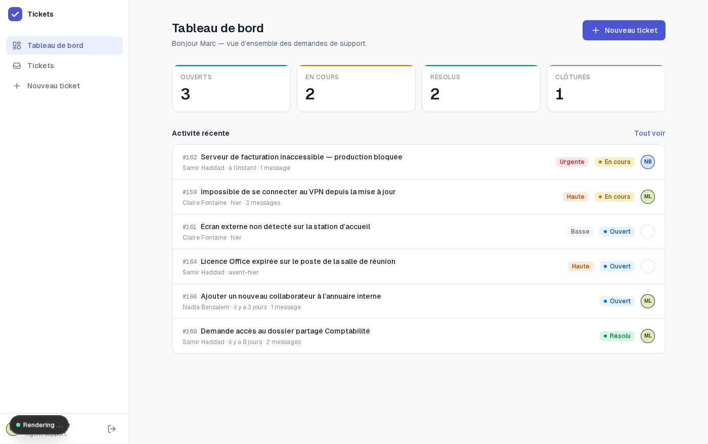
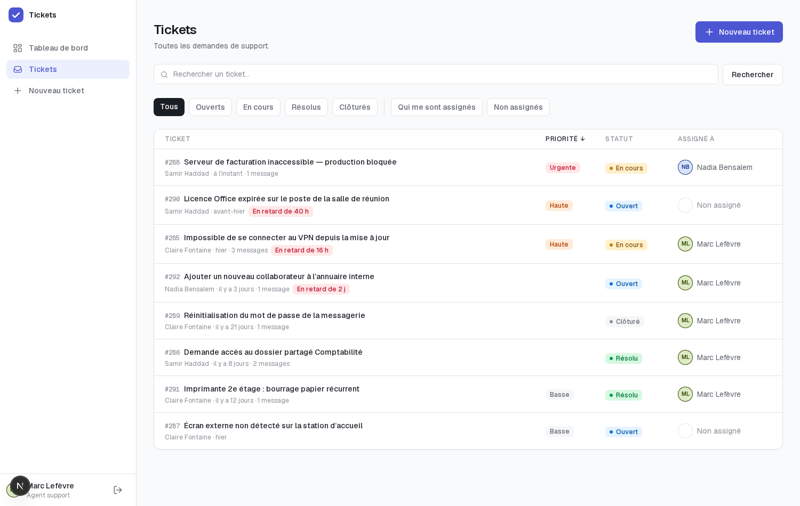
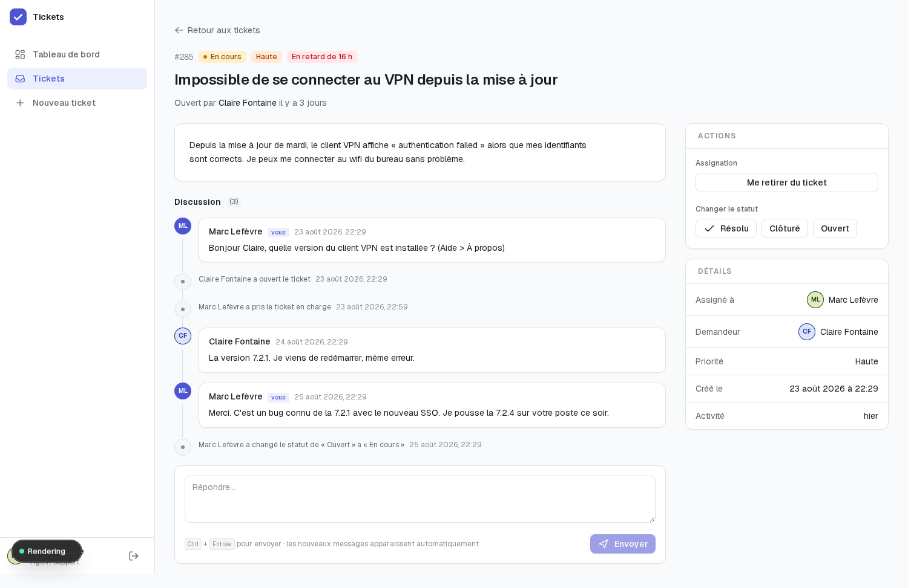
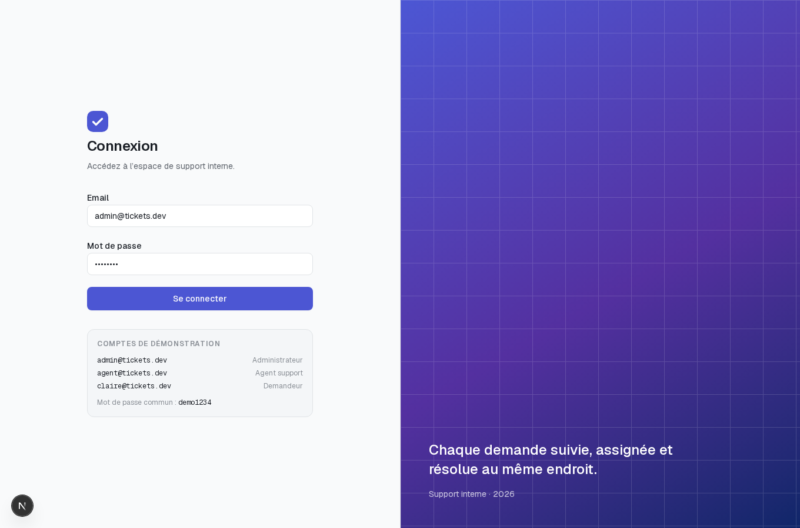

# Tickets — lightweight helpdesk

A small internal support desk: users open tickets, agents self-assign them, everyone
follows the discussion in a threaded comment view, and admins get a status dashboard.

Built with Next.js (App Router), Prisma, PostgreSQL, Auth.js and Tailwind.

### ▶︎ [Live demo](https://tickets-helpdesk-brown.vercel.app) — `admin@tickets.dev` / `demo1234`

[](https://github.com/menina-abdelhakim/tickets-helpdesk/actions/workflows/ci.yml)




<details>
<summary>Autres écrans</summary>

**Liste des tickets, avec recherche et filtres**



**Détail d'un ticket**



**Connexion**



</details>

## Features

- **Roles.** Reporters see and discuss only their own tickets; agents see and handle
  everything; admins can additionally reassign other people's work.
- **Ticket lifecycle.** Create with priority, self-assign, move through a fixed set of
  legal status transitions, close.
- **Threaded discussion**, refreshed every 10 seconds without a page reload.
- **Filtered, sorted, searchable list** — by status, "assigned to me", "unassigned",
  sortable columns, and a Postgres full-text search that ignores accents and matches word
  variants (`ecran` finds *Écran*, `licences` finds *Licence*). Every one of these lives
  in the URL, so a view can be bookmarked, shared and restored with the back button.
- **Audit trail.** Creation, assignment and status changes are recorded and interleaved
  with the discussion on a single timeline, so a ticket can never change without leaving
  a trace of who did it and when.
- **SLA clock.** Each priority carries a response target; the clock restarts on the last
  reply from support, and only late or nearly-late tickets are flagged.
- **Rate-limited creation**, so a public demo cannot be filled in a loop.
- **Dashboard** with per-status counts, scoped to what you are allowed to see.

## Demo accounts

The seed data creates four users. Password for all of them: `demo1234`

| Email                | Role  | Sees            | Can do                                              |
| -------------------- | ----- | --------------- | --------------------------------------------------- |
| `admin@tickets.dev`  | ADMIN | Every ticket    | Everything, plus unassigning other agents           |
| `agent@tickets.dev`  | AGENT | Every ticket    | Self-assign, change status, comment anywhere        |
| `claire@tickets.dev` | USER  | Her own tickets | Open tickets, comment on her own                    |
| `samir@tickets.dev`  | USER  | His own tickets | Open tickets, comment on his own                    |

There is deliberately **no public sign-up**: accounts come from the seed, so a shared
demo cannot be filled with junk. Adding registration would be a `prisma.user.create`
with a `bcrypt.hash` — the same call the seed already makes.

## Quickstart

Requires Node 22+ and Docker.

```bash
npm install
cp .env.example .env          # then set AUTH_SECRET (see below)
npm run db:up                 # PostgreSQL 17 in Docker, on port 5433
npm run db:migrate            # apply migrations
npm run db:seed               # 4 accounts + 8 realistic tickets
npm run dev
```

Prefer an empty board? `npm run db:clear` removes every ticket and keeps the four
accounts, so you can still sign in. `npm run db:seed` brings the demo data back.

Open http://localhost:3000 and sign in with one of the demo accounts.

Generate an `AUTH_SECRET` with:

```bash
openssl rand -base64 33
```

> The database container listens on **5433**, not the default 5432, so it does not
> collide with a PostgreSQL instance already running on the host.

## Scripts

| Command              | What it does                                  |
| -------------------- | --------------------------------------------- |
| `npm run dev`        | Dev server                                    |
| `npm run build`      | `prisma generate` + production build          |
| `npm run typecheck`  | `tsc --noEmit`                                |
| `npm run test:unit`  | Vitest unit tests                             |
| `npm run test:coverage` | Unit tests with a coverage report          |
| `npm run test:e2e`   | Playwright (starts the dev server on its own) |
| `npm run db:up`      | Start PostgreSQL in Docker                    |
| `npm run db:seed`    | Reset tickets and reload demo data            |
| `npm run db:clear`   | Delete every ticket, keep the accounts        |
| `npm run db:studio`  | Prisma Studio, to browse the database         |
| `npm run db:reset`   | Drop, re-migrate and re-seed                  |

## Data model

Three tables, two real relations to `User` from `Ticket` (author and assignee),
and comments hanging off tickets.

```
User ──< Ticket (createdBy)      Ticket ──< Comment >── User (author)
User ──< Ticket (assignedTo, nullable)
```

- `Ticket.reference` is an auto-incrementing integer so tickets can be referred to
  as `#42` in the UI, while ids stay opaque cuids.
- Indexes on `Ticket.status` and `Ticket.assignedToId` back the dashboard counts and
  the "assigned to me" filter; `Comment` is indexed on `(ticketId, createdAt)` because
  the comment poll always reads a thread in chronological order.
- `onDelete: SetNull` on the assignee means deleting an agent unassigns their tickets
  rather than deleting them.

## Design system

Every colour in the app is a semantic token — `surface`, `content`, `border`, `accent` —
defined once in `src/app/globals.css` and exposed to Tailwind through `@theme inline`.
A component is written `bg-surface text-content`, never with a raw palette value, so the
whole interface can be retuned from one block. Colours are declared in `oklch` so
lightness stays perceptually even across hues.

**The interface is light-only, by design.** `color-scheme: light` is declared on the root
and echoed as a `<meta name="color-scheme">` through Next's `viewport` export, so the
app — including native form controls and scrollbars — stays light on a machine set to
dark mode, and paints light from the first frame rather than flashing dark UA styling.
There is no `prefers-color-scheme` block and no `dark:` variant anywhere in the markup.

Supporting pieces: `src/components/ui.tsx` (buttons with a built-in loading state,
cards, fields, avatars, empty states), `src/components/icons.tsx` (a hand-rolled inline
SVG set — a handful of icons does not justify an icon dependency),
`src/components/skeleton.tsx`, and `src/components/ticket-row.tsx`, shared by the
dashboard and the list so the two cannot drift apart.

Navigation is a fixed sidebar on desktop and an off-canvas drawer below `lg`. The drawer
is toggled with `display`, not a transform: a panel moved off-screen with `translate`
stays focusable and reachable by screen readers, which would quietly expose the whole
navigation to keyboard users on mobile.

The app honours `prefers-reduced-motion` and gives every interactive element the same
focus ring.

## Architecture notes

- **Authorisation lives in one module.** `src/lib/permissions.ts` holds the rules and,
  crucially, exposes visibility as a Prisma `where` fragment that every ticket query
  spreads — an unauthorised row is never loaded, rather than loaded and filtered out.
  Server actions re-check permissions after re-reading the ticket through that same
  scoped query, because form fields are user input.
- **Legal status transitions are data**, not `if` statements: the detail page renders
  exactly the buttons the server action will accept, so UI and rules cannot drift.
- **Search is a generated `tsvector` column with a GIN index**, not a `LIKE`. Postgres
  maintains it: a `STORED` generated column can never drift from the row it describes.
  The title is weighted above the description, and an `IMMUTABLE` `unaccent` wrapper makes
  matching accent-insensitive — necessary in French, where people type `ecran` for *écran*.
  The raw query returns **ids only**, which are fed back into the normal Prisma query, so
  visibility rules stay in one place instead of being restated in SQL.
- **Audit entries are written in the same transaction as the change they describe**, so a
  ticket can never move without a trace, and a trace can never describe a move that was
  rolled back.
- **Rate limiting counts rows in the database**, not entries in a process-local map: a
  serverless function is recreated constantly, and an in-memory counter would reset with it.
- **Suspense boundaries sit inside the pages, not in a route-level `loading.tsx`.**
  A `loading.tsx` under `(app)/` would wrap every child route, `/tickets/[id]` included.
  Once Next begins streaming, the `200` headers are already on the wire, so `notFound()`
  can still render the not-found UI but can no longer set a `404` status — which would
  have silently broken the "a foreign ticket is indistinguishable from a missing one"
  property. The authorisation spec asserts on the status code and caught it.

- **Sessions are JWTs, not database rows.** The Credentials provider does not support
  the database session strategy, and the JWT carries the role so authorisation checks
  need no extra query.
- **No proxy/middleware auth check.** Every protected page calls `auth()` itself. In
  Next 16 `middleware` was renamed `proxy` and now defaults to the Node.js runtime, so
  running the check there *would* work — but a proxy check only guards navigation, and
  the authoritative check belongs next to the data access it protects. Keeping it in
  the server component means a new route can never silently skip it.
- **Prisma 7 uses a driver adapter.** The connection string lives in `prisma.config.ts`
  and `src/lib/prisma.ts` passes a `PrismaPg` adapter to the client — `url` in
  `schema.prisma` is no longer supported.
- **The Prisma client is generated into `src/generated/`**, which is gitignored and
  rebuilt by the `postinstall` script.
- **Polling, not WebSockets.** New comments will be fetched every 10s. For a helpdesk
  this is the right trade-off: no connection state, no scaling concerns.

## Tests

Two layers, because they answer different questions.

**Unit tests** (Vitest) cover the pure logic — authorisation rules and date formatting:

```bash
npm run test:unit          # 38 tests
npm run test:coverage      # with a coverage report
```

Coverage is **scoped to the pure logic — authorisation, SLA, rate limiting, date and
event formatting — where it sits at 100%**, and the run fails below 90%. That scope is deliberate: instrumenting the React
tree would inflate the figure with lines only a browser can exercise, and a coverage
number you cannot defend in review is worth less than no number at all. The rules that
decide who may read and change a ticket are exactly the code that deserves exhaustive,
fast, dependency-free tests.

**End-to-end tests** (Playwright) cover the flows a user actually performs:

```bash
npm run test:e2e           # 20 specs
```

> The suite reseeds the database before it runs (`e2e/global-setup.ts`), so any
> ticket you created by hand while clicking around is discarded. That is what makes
> the run deterministic — assertions on dashboard counts depend on a known fixture.

Twelve Playwright specs in four files:

- `auth.spec.ts` — redirect when signed out, successful login, rejected password, sign-out.
- `authorization.spec.ts` — a reporter sees only their own tickets, an agent sees all,
  a foreign ticket returns 404 rather than 403 (so nobody can probe for existence), a
  reporter is offered no agent actions, and dashboard counts are scoped per role.
- `ticket-lifecycle.spec.ts` — the full path: login → create → assign → comment → close,
  plus server-side validation rejecting a too-short description.
- `polling.spec.ts` — two browser contexts at once: a comment written by an agent shows
  up in the reporter's open page without a reload.
- `features.spec.ts` — the audit trail survives a reload, search ignores accents and
  never widens what a reporter may see, sorting preserves the active filter, and a burst
  of ticket creation is refused.

The specs run in parallel, so each one either creates its own ticket or asserts against
a user whose seeded data no other spec mutates — the suite passes repeatedly against a
database the previous run already modified.

Assertions on ticket status target `data-testid="status-badge"` rather than the visible
text, because the actions panel renders buttons carrying those same labels; matching the
button would let a navigation race ahead of the server action and pass for the wrong
reason.

## Roadmap

- [x] Schema, migrations, seed data
- [x] Credentials auth with roles, protected routes
- [x] Ticket list with filters, create form, detail page
- [x] Threaded comments with 10s polling
- [x] Self-assign and guarded status transitions
- [x] Playwright suite: auth, authorisation and the full lifecycle
- [x] GitHub Actions CI
- [x] Full-text search across titles and descriptions
- [x] Unit tests with enforced coverage thresholds
- [x] Deployed to Vercel + Neon
- [x] Ticket history: who changed what, and when
- [x] Sortable columns, with filters and sort kept in the URL
- [x] SLA indicator based on the last reply from support
- [x] Rate limiting on ticket creation
- [x] Accent-insensitive Postgres full-text search
- [ ] Attachments on tickets and comments — needs object storage
- [ ] Email notification on assignment — needs a mail provider

## Deploying

Vercel for the app, Neon for the database. The only thing that differs from local
development is the connection string.

### 1. Database

Create a project on [Neon](https://neon.tech) and copy **both** connection strings from
the dashboard:

- the **pooled** one (host contains `-pooler`) → this becomes `DATABASE_URL`
- the **direct** one (no `-pooler`) → this becomes `DIRECT_URL`

The distinction matters. The application runs on serverless functions and needs the
pooler, or a burst of cold starts exhausts the connection limit. Migrations must *not*
go through the pooler: PgBouncer in transaction mode cannot hold the session and
advisory locks `prisma migrate deploy` takes. `prisma.config.ts` reads `DIRECT_URL`
when it is set and falls back to `DATABASE_URL` locally, where one Postgres does both.

### 2. Vercel

Import the repository on [Vercel](https://vercel.com/new). Set three environment
variables for **Production** (and Preview, if you want preview deployments to work):

| Variable        | Value                                              |
| --------------- | -------------------------------------------------- |
| `DATABASE_URL`  | Neon **pooled** connection string                   |
| `DIRECT_URL`    | Neon **direct** connection string                   |
| `AUTH_SECRET`   | `openssl rand -base64 33` — a fresh one, not the local value |

Do **not** set `AUTH_URL`. Auth.js infers the deployment URL on Vercel and trusts the
host automatically; pointing it at `localhost` would break every redirect after sign-in.

Vercel runs the `vercel-build` script when it exists, so `prisma generate`,
`prisma migrate deploy` and `next build` all run on deploy. The plain `build` script is
left alone, so a local build never needs a reachable database.

### 3. Demo data

A public demo with an empty dashboard shows nothing. Seed it once, from your machine,
against the **direct** connection string:

```bash
DATABASE_URL="<direct-neon-url>" npx prisma db seed
```

Sign in with `admin@tickets.dev` / `demo1234`, and put the deployment URL at the top of
this README.

### Redeploying

Push to `main`. Migrations apply automatically; the seed does not re-run, so demo data
is only reset when you run the command above again.

## Known issues

`npm audit` reports 3 high advisories in `deepmerge-ts`, reached through
`prisma` → `@prisma/config`. That is a devDependency used by the CLI only; it is not
part of the deployed application. It clears when Prisma updates the dependency.
